# Geany WebDev Snippets

## Introduction

I was a fan of [Notepad++](https://notepad-plus-plus.org/) source code editor, but it doesn't support Linux Operating System. Since I'm also a fan of Linux, so I decided to switch to another lightweight text editor. 

Fortunately, I found [Geany](https://www.geany.org/), a powerful, stable and lightweight programmer's text editor that provides tons of useful features without bogging down your workflow. It runs on Linux, Windows and macOS is translated into over 40 languages, and has built-in support for more than 50 programming languages.

However, Geany doesn't have [Emmet](https://emmet.io/) plugin for now. So for speeding up the workflow of my daily web development, I decided to make my version of web development snippets for Geany. And I made it, it's not perfect but "as long as it's simple, it makes your life simple". For those who want to use it as your web development snippets in Geany, I made an instruction below for you guys on how to add snippets into Geany.

## Getting started

> ### Step 1: Copy the example snippets that you need from [snippets.conf](https://github.com/zhaolinlau/Geany-WebDev-Snippets/blob/main/snippets.conf)

> ### Step 2: Open Geany and go to `Tools` -> `Configuration Files` -> `snippets.conf`
>
> 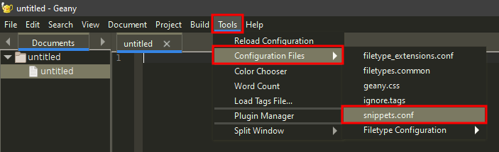

> ### Step 3: Paste to the `[HTML]` and/or `[JavaScript]` and/or `[PHP]` based on what language you wanted to replace
>
> 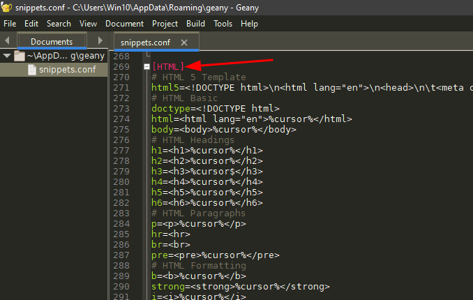

> ### Step 4: Press `CTRL+S` to save it

## How to use snippet

> ### Step 1: Type the snippet keyword
>
>  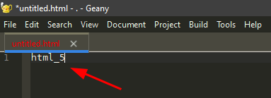

> ### Step 2: Press `Tab` and it will autocomplete the whole template for you
>
> 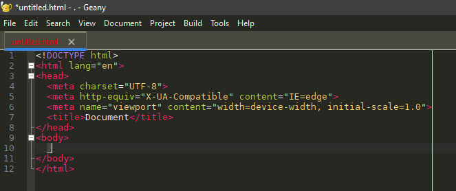

## Setup keybinding (Recommended)

I highly recommend you guys to setup keybinding for `Move cursor in snippet` because it's very useful and convenient when using snippets.

> ### Step 1: Go to `Edit` -> `Preferences`
>
> 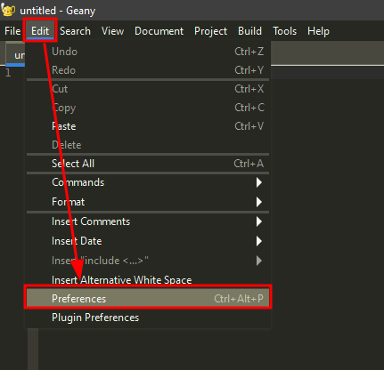

> ### Step 2: Go to `Keybindings` and select `Move cursor in snippet`, then click `Change`
>
> 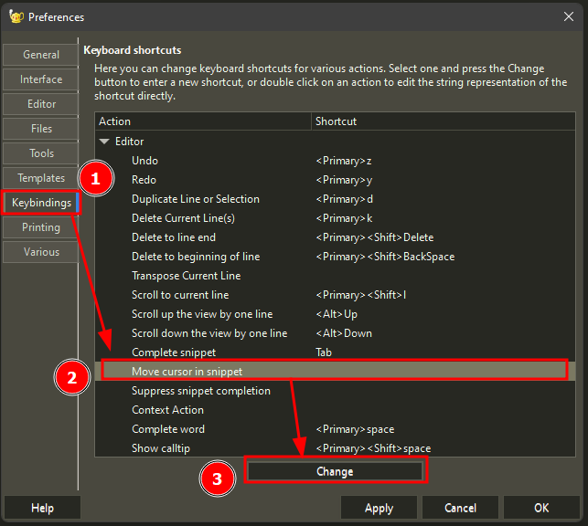

> ### Step 3: Press `CTRL+]` and click `OK`
>
> 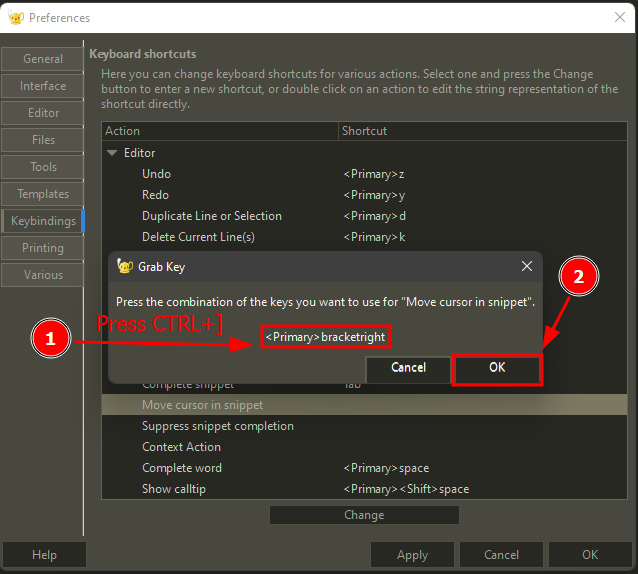

> ### Step 4: Click `OK` again
>
> 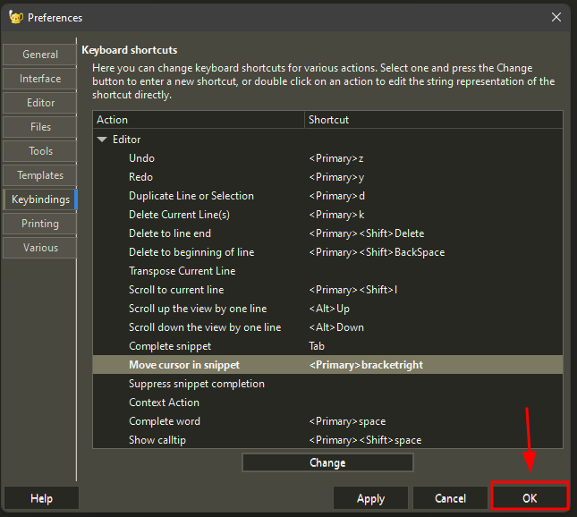

## How to use keybinding

Before using the keybinding, you guys have to setup first and may refer to [Setup keybinding (Recommended)](#setup-keybinding-recommended).

> ### Step 1: Type the snippet keyword
>
>  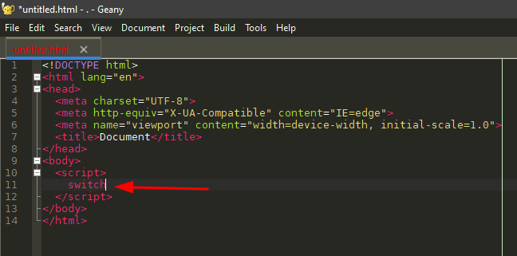

> ### Step 2: Press `Tab` and it will autocomplete the whole template for you
>
> 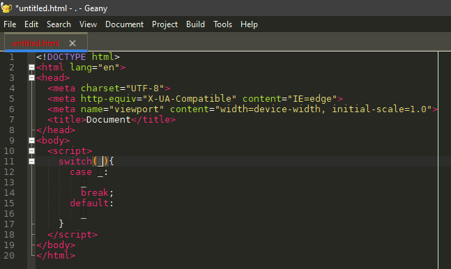

> ### Step 3: Type something inside the `switch(_)`
>
> 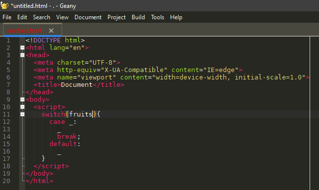

> ### Step 4: Press `CTRL+]` and it will jump to the next `_` 
>
> 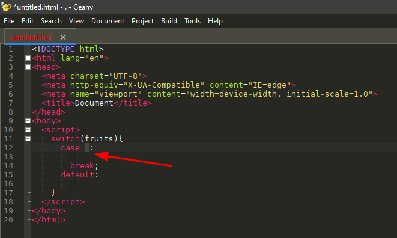
>
> ### *Now you can just straight type something inside the `_` without manually select or highlight the `_` because it's already being selected and highlighted after pressing `CTRL+]` just now.*

## Adding syntax highlighting & html snippets for .vue filetype (Optional)

> ### Step 1: Go to Tools -> Configuration Files -> filetype_extensions.conf
>
> 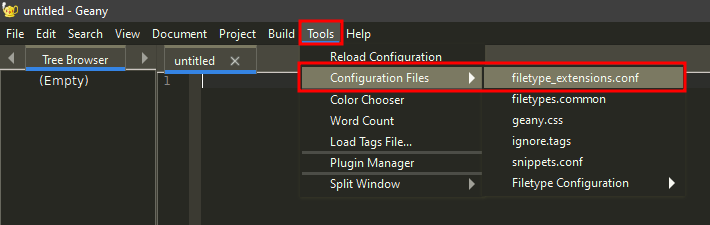

> ### Step 2: Remove `#~ #` from `#~ # [Extensions]`
>
> ### *Now it should be look like* `[Extensions]`
>
> 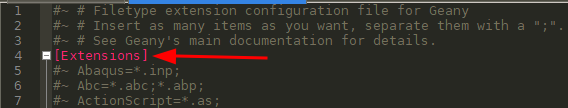

> ### Step 3: Remove `#~` from `#~ HTML=*.htm;*.html;*.shtml;*.hta;*.htd;*.htt;*.cfm;*.tpl;`
>
> ### *Now it should be look like* `HTML=*.htm;*.html;*.shtml;*.hta;*.htd;*.htt;*.cfm;*.tpl;`

> ### Step 4: Then add `*.vue;` to `HTML=*.htm;*.html;*.shtml;*.hta;*.htd;*.htt;*.cfm;*.tpl;`
>
> ### *Now it should be look like* `HTML=*.htm;*.html;*.shtml;*.hta;*.htd;*.htt;*.cfm;*.tpl;*.vue;`
> 
> 

> ### Step 5: Press `CTRL+S` to save it

## Summary

If you follow my instructions above, you will be able to use the snippets. Hope it helps you. Feel free to open issue if you have any issues. 
