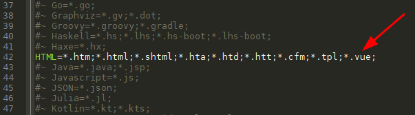

# Geany WebDev Snippets

## Introduction

I was a fan of [Notepad++](https://notepad-plus-plus.org/) source code editor, but it doesn't support Linux Operating System. Since I'm also a fan of Linux, so I decided to switch to another lightweight text editor. 

Fortunately, I found [Geany](https://www.geany.org/), a powerful, stable and lightweight programmer's text editor that provides tons of useful features without bogging down your workflow. It runs on Linux, Windows and macOS is translated into over 40 languages, and has built-in support for more than 50 programming languages.

However, Geany doesn't have [Emmet](https://emmet.io/) plugin for now. So for speeding up the workflow of my daily web development, I decided to make my version of web development snippets for Geany. And I made it, it's not perfect but "as long as it's simple, it makes your life simple". For those who want to use it as your web development snippets in Geany, I made an instruction below for you guys on how to add snippets into Geany.

## Getting Started

> ### Step 1: Copy the example snippets that you need from below or [snippets.conf](https://github.com/zhaolinlau/Geany-WebDev-Snippets/blob/main/snippets.conf)

```
# HTML 5 Template
html_5=<!DOCTYPE html>\n<html lang="en">\n<head>\n\t<meta charset="UTF-8">\n\t<meta http-equiv="X-UA-Compatible" content="IE=edge">\n\t<meta name="viewport" content="width=device-width, initial-scale=1.0">\n\t<title>%cursor%</title>\n</head>\n<body>\n\t\n</body>\n</html>
# HTML Basic
doctype=<!DOCTYPE html>
html=<html lang="en">%cursor%</html>
body=<body>%cursor%</body>
# HTML Attributes
class=class="%cursor"
id=id="%cursor%"
onlick=onclick="%cursor%"
# HTML Headings
h1=<h1>%cursor%</h1>
h2=<h2>%cursor%</h2>
h3=<h3>%cursor$</h3>
h4=<h4>%cursor%</h4>
h5=<h5>%cursor%</h5>
h6=<h6>%cursor%</h6>
# HTML Paragraphs
p=<p>%cursor%</p>
hr=<hr>
br=<br>
pre=<pre>%cursor%</pre>
# HTML Formatting
b=<b>%cursor%</b>
strong=<strong>%cursor%</strong>
i=<i>%cursor%</i>
em=<em>%cursor%</em>
mark=<mark>%cursor%</mark>
small=<small>%cursor%</small>
del=<del>%cursor%</del>
ins=<ins>%cursor%</ins>
sub=<sub>%cursor%</sub>
sup=<sup>%cursor%</sup>
# HTML Quotations
blockquote=<blockquote>%cursor%</blockquote>
blockquote_cite=<blockquote cite="">%cursor%</blockquote>
q=<q>%cursor%</q>
abbr=<abbr title="">%cursor%</abbr>
address=<address>%cursor%</address>
cite=<cite>%cursor%</cite>
bdo=<bdo dir="rtl">%cursor%</bdo>
# HTML CSS
style=<style>\n\t%cursor%\n</style>
link=<link rel="stylesheet" href="%cursor%">
# HTML Links
a=<a href="">%cursor%</a>
a_target=<a href="" target="_blank">%cursor%</a>
# HTML Images
img=
map=<map name="%cursor%"></map>
area=<area shape="" coords="" alt="" href="%cursor%">
picture=<picture>%cursor%</picture>
sourcemedia=<source media="(min-width:)" srcset="%cursor%">
# HTML Favicon
link_favicon=<link rel="icon" type="image/x-icon" href="%cursor%">
# HTML Tables
table=<table>\n\t%cursor%\n</table>
th=<th>%cursor%</th>
tr=<tr>\n\t%cursor%\n</tr>
td=<td>%cursor%</td>
caption=<caption>%cursor%</caption>
colgroup=<colgroup>\n\t%cursor%\n</colgroup>
col=<col>%cursor%</col>
thead=<thead>\n\t%cursor%\n</thead>
tbody=<tbody>\n\t%cursor%\n</tbody>
tfoot=<tfoot>\n\t%cursor%\n</tfoot>
# HTML Lists
ul=<ul>\n\t%cursor%\n</ul>
ol=<ol>\n\t%cursor%\n</ol>
li=<li>%cursor%</li>
dl=<dl>\n\t%cursor%\n</dl>
dt=<dt>%cursor%</dt>
dd=<dd>%cursor%</dd>
# HTML Block & Inline
div=<div>%cursor%</div>
span=<span>%cursor%</span>
# HTML Iframes
iframe=<iframe src="%cursor%" width="" height=""></iframe>
# HTML JavaScript
script=<script>\n\t%cursor%\n</script>
script_src=<script src="%cursor%"></script>
noscript=<noscript>%cursor%</noscript>
# HTML Head
head=<head>\n\t%cursor%\n</head>
title=<title>%cursor%</title>
meta=<meta name="%cursor%" content="">
meta_utf=<meta charset="UTF-8">
meta_compat=<meta http-equiv="X-UA-Compatible" content="IE=edge">
meta_vp=<meta name="viewport" content="width=device-width, initial-scale=1.0">
base=<base href="%cursor%">
base_target=<base href="%cursor%" target="_blank">
# HTML Layout
header=<header>\n\t%cursor%\n</header>
nav=<nav>\n\t%cursor%\n</nav>
section=<section>\n\t%cursor%\n</section>
article=<article>\n\t%cursor%\n</article>
aside=<aside>\n\t%cursor%\n</aside>
footer=<footer>\n\t%cursor%\n</footer>
details=<detials>\n\t%cursor%\n</details>
summary=<summary>%cursor%</summary>
# HTML Computer Code
kbd=<kbd>%cursor%</kbd>
samp=<samp>%cursor%</samp>
code=<code>%cursor%</code>
var=<var>%cursor%</var>
# HTML Semantics
figure=<figure>\n\t%cursor%\n</figure>
figcaption=<figcaption>%cursor%</figcaption>
main=<main>\n\t%cursor%\n</main>
time=<time datetime="">%cursor%</time>
# HTML Forms
form=<form action="">\n\t%cursor%\n</form>
form_get=<form action="" method="get">\n\t%cursor%\n</form>
form_post=<form action="" method="post">\n\t%cursor%\n</form>
form_enctype=<form action="" method="post" enctype="multipart/form-data">\n\t%cursor%\n</form>
input=<input type="%cursor%">
input_button=<input type="button" value="%cursor%">
input_checkbox=<input type="checkbox" name="%cursor%" id="">
input_color=<input type="color" name="%cursor%" id="">
input_date=<input type="date" name="%cursor%" id="">
input_datetime=<input type="datetime-local" name="%cursor%" id="">
input_email=<input type="email" name="%cursor%" id="">
input_file=<input type="file" name="%cursor%" id="">
input_hidden=<input type="hidden" name="%cursor%">
input_image=<input type="image" src="%cursor%" alt="">
input_month=<input type="month" name="%cursor%" id="">
input_number=<input type="number" name="%cursor%" id="">
input_password=<input type="password" name="%cursor%" id="">
input_radio=<input type="radio" name="%cursor%" id="">
input_range=<input type="range" name="%cursor%" id="">
input_reset=<input type="reset" value="%cursor%">
input_search=<input type="search" name="%cursor%" id="">
input_submit=<input type="submit" value="%cursor%">
input_tel=<input type="tel" name="%cursor%" id="">
input_text=<input type="text" name="%cursor%" id="">
input_time=<input type="time" name="%cursor%" id="">
input_url=<input type="url" name="%cursor%" id="">
input_week=<input type="week" name="%cursor%" id="">
label=<label for="%cursor%"></label>
select=<select name="" id="">\n\t%cursor%\n</select>
option=<option value="">%cursor%</option>
textarea=<textarea name="%cursor%" id="" cols="30" rows="10"></textarea>
button=<button>%cursor%</button>
button_submit=<button type="reset">%cursor%</button>
button_reset=<button type="submit">%cursor%</button>
fieldset=<fieldset>\n\t%cursor%\n</fieldset>
legend=<legend>%cursor%</legend>
datalist=<datalist>\n\t%cursor%\n</datalist>
output=<output for="%cursor%"></output>
# HTML Canvas
canvas=<canvas>%cursor%</canvas>
# HTML SVG
sv=<svg>\n\t%cursor%\n</svg>
circle=<circle cx="%cursor%" cy="" r=""/>
rect=<rect width="%cursor%" height=""/>
polygon=<polygon point="%cursor%"/>
defs=<defs>%cursor%</defs>
linearGradient=<linearGradient x1="" y1="" x2="" y2="">%cursor%</linearGradient>
stop=<stop offset="%cursor%"/>
ellipse=<ellipse cx="" cy="" rx="" ry="" fill="url(%cursor%)"/>
text=<text fill="" font-size="" font-family="" x="" y="">%cursor%</text>
# HTML Video
video=<video controls>\n\t%cursor%\n</video>
source=<source src="%cursor%" type="">
source_video=<source src="%cursor%" type="video/mp4">
track=<track src="%cursor%" kind="subtitles" srclang="" label="">
# HTML Audio
audio=<audio controls>%cursor%</audio>
source_audio=<source src="%cursor%" type="audio/mpeg">
# HTML Plug-ins
object=<object data="%cursor%"></object>
embed=<embed src="%cursor%">
# Others
template=<template>\n\t%cursor%\n</template>
slot=<slot name="%cursor%"></slot>
# JavaScript
if=if(%cursor%) {\n\t\n}
else=else {\n\t%cursor%\n}
for=for(%cursor%) {\n\t\n}
while=while(%cursor%) {\n\t\n}
do=do {\n\t%cursor%\n} while()
switch=switch(%cursor%) {\n\tcase :\n\t\t\n\t\tbreak;\n\tdefault:\n\t\t\n}
try=try {\n\t%cursor%\n} catch() {\n\t\n}
function=function %cursor%() {\n\t\n}
class=class %cursor% {\n\t\n}
# Vue 3
vtext=v-text="%cursor%"
vhtml=v-html="%cursor%"
vshow=v-show="%cursor%"
vif=v-if="%cursor%"
velse=v-else
velseif=v-else-if="%cursor%"
vfor=v-for="%cursor%"
von=v-on:
vbind=v-bind:
vmodel=v-model="%cursor%"
vslot=v-slot
vpre=v-pre
vonce=v-once
vmemo=v-memo="%cursor%"
vclock=v-clock
# Vue 3 Options API
mounted=mounted() {\n\t%cursor%\n},
methods=methods: {\n\t%cursor%\n},
unmounted=unmounted() {\n\t%cursor%\n},
updated=updated() {\n\t%cursor%\n},
components=components: {\n\t%cursor%\n},
# Vue 3 Composition API
onMounted=onMounted(() => {\n\t%cursor%\n})
onUpdated=onUpdated(() => {\n\t%cursor%\n})
onUnmounted=onUnmounted(() => {\n\t%cursor%\n})
```

> ### Step 2: Open Geany and go to Tools -> Configuration Files -> snippets.conf
>
> 

> ### Step 3: Paste to the `[HTML]` and/or `[JavaScript]` and/or `[PHP]` based on what language you wanted to replace
>
> 

> ### Step 4: Press `CTRL+S` to save it

## Adding syntax highlighting & html snippets for .vue filetype

> ### Step 1: Open Geany and go to Tools -> Configuration Files -> filetype_extensions.conf
>
> 

> ### Step 2: Remove `#~ #` from `#~ # [Extensions]`
>
> *Now it should be look like* `[Extensions]`
>
> 

> ### Step 3: Remove `#~` from `#~ HTML=*.htm;*.html;*.shtml;*.hta;*.htd;*.htt;*.cfm;*.tpl;`
>
> *Now it should be look like* `HTML=*.htm;*.html;*.shtml;*.hta;*.htd;*.htt;*.cfm;*.tpl;`

> ### Step 4: Then add `*.vue;` to `HTML=*.htm;*.html;*.shtml;*.hta;*.htd;*.htt;*.cfm;*.tpl;`
>
> *Now it should be look like* `HTML=*.htm;*.html;*.shtml;*.hta;*.htd;*.htt;*.cfm;*.tpl;*.vue;`
> 
> 

> ### Step 5: Press `CTRL+S` to save it

## Summary

If you follow my instructions above, you will be able to use the snippets. Hope it helps you. Feel free to open issue if you have any issues. 
